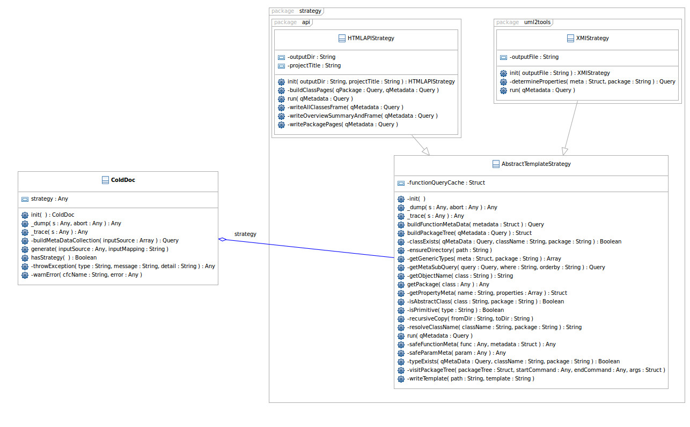

# UML Output


UML2 Tools hasn't been developed for Eclipse since 2008. This strategy is now more for reference than anything else.


This is a documentation strategy that ultimately lets you generate UML diagrams from the CFCs that you have written. That being said, it does not actually generate diagrams.

What this template startegy does is generate the XML file the Eclipse UML2 Tools that stores the information about your domain - the classes, the associations, the inheritence hierarchy, etc. From there it is very easy with [UML2 Tools](http://wiki.eclipse.org/MDT-UML2Tools) to generate UML diagrams like Class Diagrams, Sequence Diagrams, etc.



To get started, you need to download and install the Eclipe plugin UML2 Tools in your Eclipse install.

1. Go to: [http://www.eclipse.org/modeling/mdt/downloads/?showAll=1&hlbuild=I200907241018&project=uml2tools](http://www.eclipse.org/modeling/mdt/downloads/?showAll=1&hlbuild=I200907241018&project=uml2tools)
2. We are actually going to use the _0.9.1 Integration Builds_ plugin, simply because it is more stable, and has several key bug fixes.
3. Download the _All-In-One Update Site_ and save the .zip file
4. In Eclipse, go to _Help &gt; Install New Software_
5. Click _Add_
6. Enter the name _UML2 Tools_ in _Name_
7. Click _Archive_ and select the .zip file you downloaded.

   1 .  Click _OK_, and continue through the installation process  

Once that process is complete, the Eclipse UML2 Tools plugin should now be installed and working.

To get DocBox to generate the `.uml` file that UML2Tools needs, we use the `UML`strategy. For example:

```javascript
docBox = new DocBox();
docBox.addStrategy( "UML", { projectFile = expandPath( "./uml/docbox.uml" ) });
docbox.generate( expandPath("/docbox"), "docbox" );
```

This will generate the `.uml` \(in this case `docbox.uml`\) file which we can then use.

To view and edit the UML diagrams from here:

1. Browse to the .uml file that you generated in the _Navigator_ Pane     
2. Right click on the .uml file
3. Select _Initialise Class Diagram_
4. Select the root package that you wish to model
5. Click _OK_

You will now be presented with a UML Class diagram of your CFC model.

There are other types of UML2 diagrams that can be created. Have a look at the UML2 Tools documentation for more options.

## Strategy Assumptions

There are some assumptions that are made by this strategy, when converting from CFCs to UML diagrams, as some meta data on CFCS are not provided and/or cannot be specified.

* A property/field is determined for a class when a _get_ and _set_ function exist with the same name \(or _set_ and _is_ for boolean values\) and the argument type of the _set_ function matches the return type of the _get_/_is_ function.
* The scope for the property/field is selected by highest level of exposure between the _getÂ_ and _set_ functions. I.e. if _getFoo\(\)_ is public, and _setFoo\(\)_ is private, then the property _foo_ is marked as public.     
* All associations are of type _aggregation_, rather than _composition_

